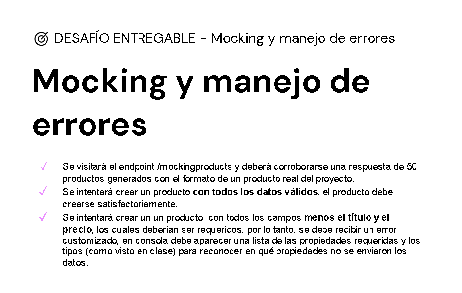
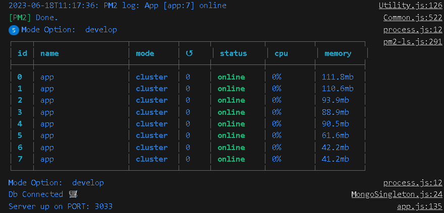
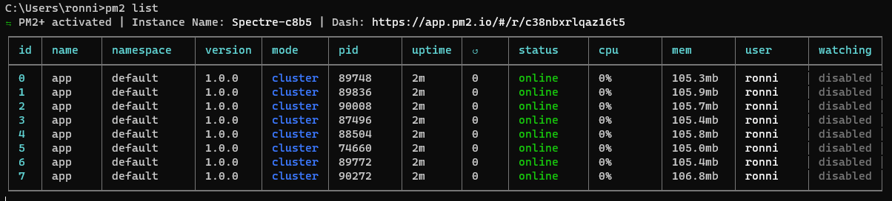
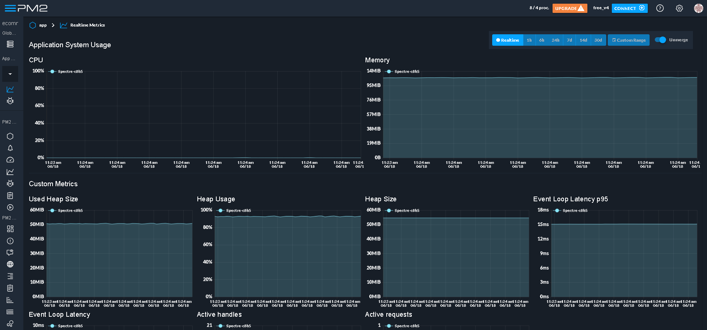
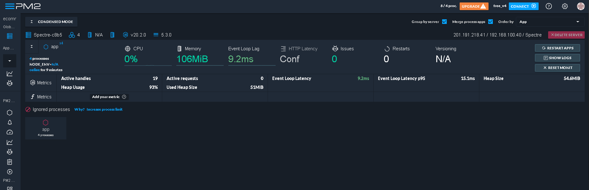
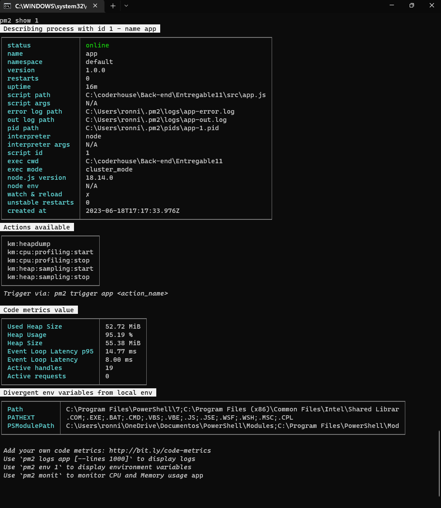
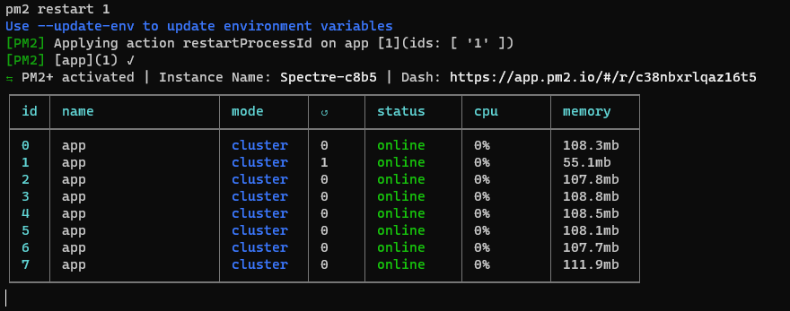
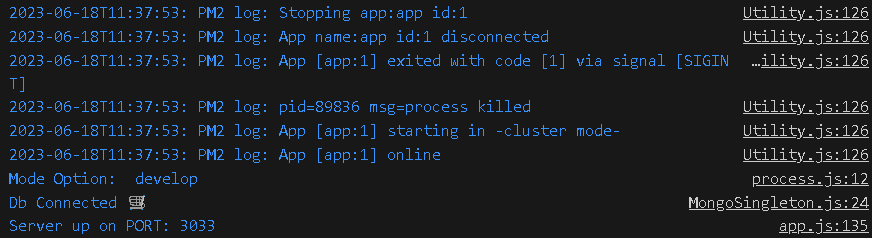
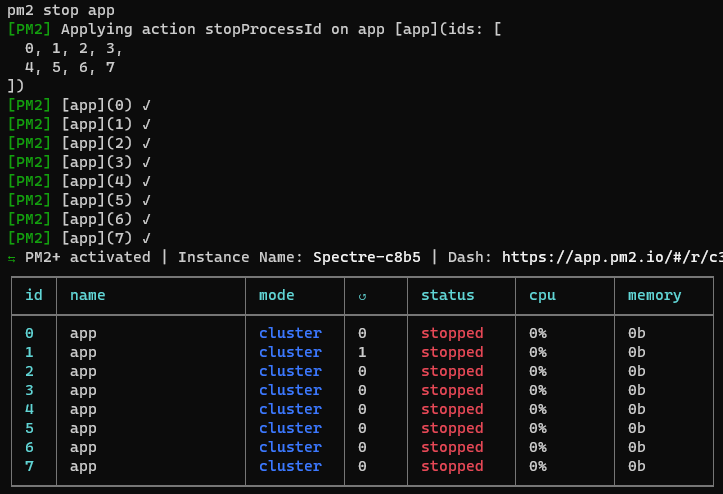

# Tercera Entrega del Proyecto Final

# RONNIE ALVAREZ CASTRO 

## Manejador de Errores personalizado y Mocking de datos

### Ademas de la consigna se implemento la Compression Brotli y 
### el uso de Process Manager PM2 
### en la imagenes de abajo estan algunos de los resultados

### http://localhost:3033/

